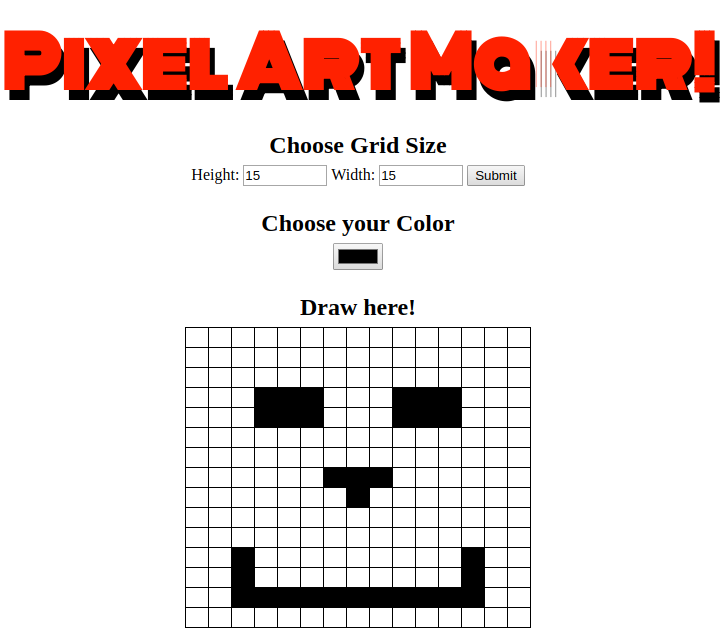

## Pixel art

This project was created using mostly html and jQuery to create a canvas using <table> 
so users can channel their inner _picasso_ and create some art!

 
There are no dependances needed to run this project

to run this project:
-click the link below
-input values for the size of the canvas,
-choose a color,
-click the square to paint it,
-double click the square to erase it.
the color can be changed inbetween clicks so be creative!

https://buttacavoli01.github.io/Pixel_art/

